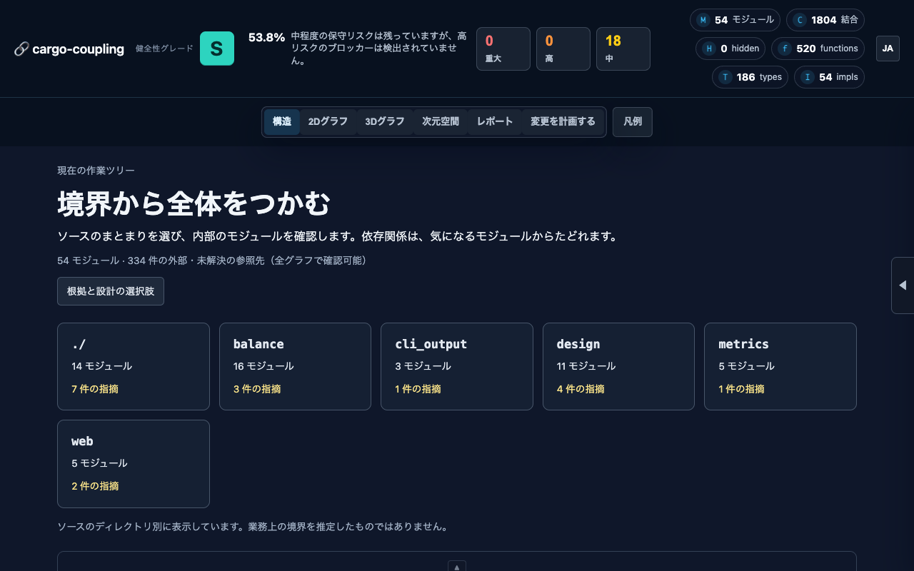
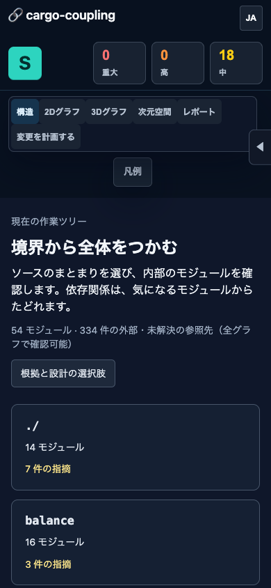
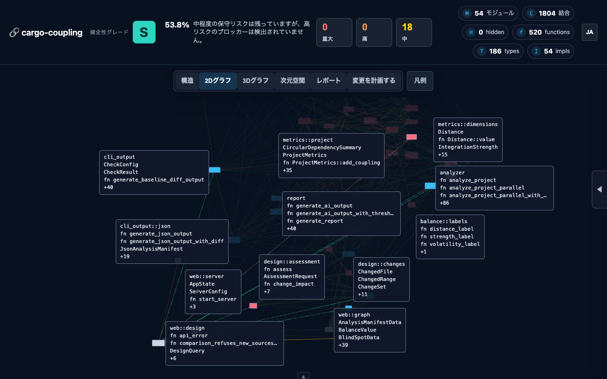
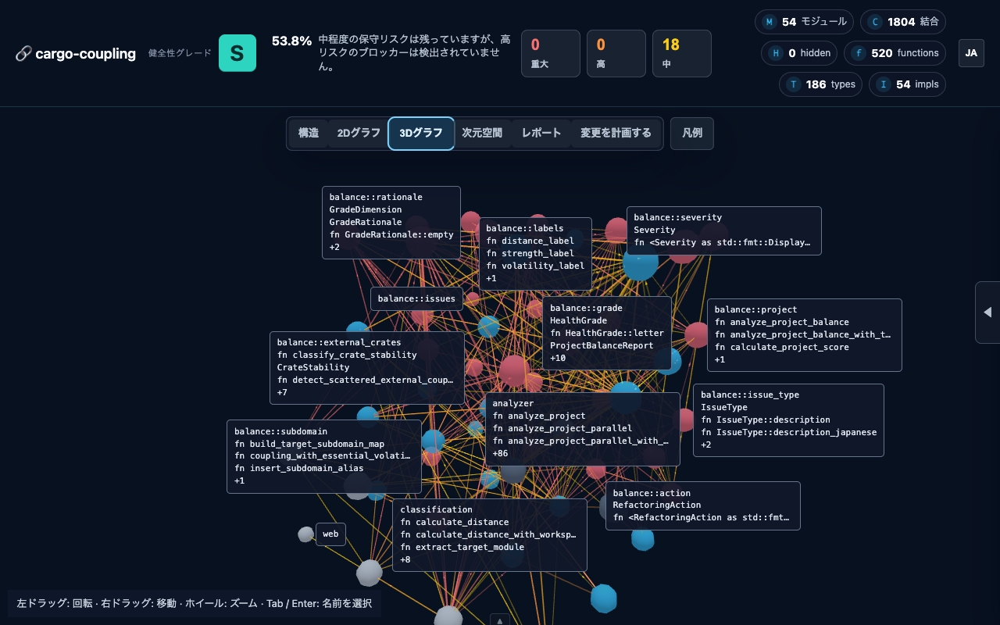
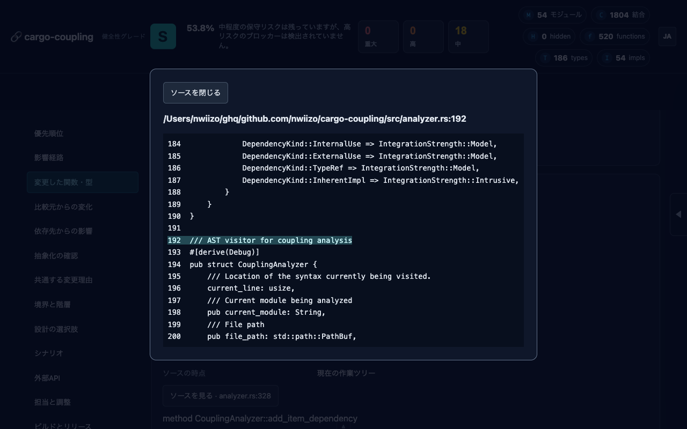

# v0.4.0 verification

Verified locally on 2026-09-08. This record covers the working tree based on
`d4c4d37cee9dcbaccc89e9b737ac643eae238d6b`, before the release commit. Git-derived
observations change when commits, the observation window or scope change.

## Jobs and evidence

The [design guide](design-analysis.md) maps each job to its output and limits.
The fixture in `tests/design_e2e.rs` exercises declarations, scenarios (including
unmatched selectors), shared release units, runtime relationships, ownership and
review triggers. Its Git fixture changes an origin across three dependency hops,
finds current test candidates, and retains a removed item's historical revision.
Unit tests cover strong-path exposure, alias ambiguity, source observations,
context validation, scenario aggregation and decisions with missing evidence.

The real repository was also inspected with:

```bash
cargo coupling --design --json --context docs/examples/design-context.toml \
  --changed-since d4c4d37 --exclude-tests .
```

This run produced 29 change origins, 231 changed source items, 141 inherited
exposures, 32 abstraction candidates, 73 shared-reason observations, 691 hierarchy
rows, 37 priorities and 1,804 source-linked dependency observations. Supplied
context produced a scenario, three lifecycle groups, one runtime relationship
and a retained decision requiring review. The example owners/plans/estimates
are illustrative, not claims about this repository's organization. Test
candidates are incomplete with `--exclude-tests`; the integration fixture checks
that job with tests included.

The fixed-settings baseline comparison reports 8 new, 1 worsened and 1 resolved
findings. All new/worsened findings are Medium. It reanalyzes both revisions
with the current analyzer, configuration and scoring method; it does not
reproduce a historical published score. The worsened finding is outgoing
coupling in `web::graph`, which now produces item/source evidence and applies
essential volatility. That finding remains visible.

## Self-directed refactoring

Commands use the just-built binary through Cargo's subcommand lookup:

```bash
PATH="$PWD/target/release:$PATH" cargo coupling --exclude-tests --hotspots=10 .
PATH="$PWD/target/release:$PATH" cargo coupling --exclude-tests --summary .
similarity-rs src --skip-test --threshold 0.90 --min-lines 10
```

After canonical alias counting was corrected, the same analyzer/settings were
used before and after splitting CLI JSON/hotspot responsibilities:

| `cli_output` observation | Before focused split | After |
| --- | ---: | ---: |
| Outgoing dependencies | 36 | 28 |
| Hotspot score | 176 | 132 |
| Outgoing-coupling severity | High | Medium |
| God Module finding, tests excluded | Present | Absent |

The final 54-source-file analysis with Git and tests excluded reports grade A,
numeric health score 0.5496, zero High/Critical and 44 Medium findings. Nine of
the Medium findings are accidental-volatility diagnostics, which are not graded.
Ten representative cycle paths cover 14 modules; these are not a count of all
possible simple cycles. A grade is not evidence that every boundary is ideal.

Confirmed changes include one graph construction per JSON report, one shared
balance calculation, immutable analyzed method names/spans, shared module-name
resolution, focused CLI reporting modules, separate design planning and HTTP
adapters, and shared 2D/3D label content/placement. Moved CLI files retain their
supporting classification; new design-judgment modules are classified as core.
No dependency threshold was raised to remove a warning.

`similarity-rs` reports seven remaining pairs at the stated settings. Each was
read before deciding whether to merge it:

- `forwarded_call` / `forwarded_argument`: different AST levels.
- Lifecycle / runtime relationships: different evidence and user jobs.
- Distance / volatility percentages: distinct dimension types.
- Serde types / public-field types: distinct predicates.
- English / Japanese issue descriptions: separate language content.
- Japanese issue descriptions / refactoring advice: observation versus action.
- Manifest Markdown / summary: different output detail.

These candidates do not justify new abstractions solely to reduce similarity.
The duplicated coupling constructor was consolidated through the existing
constructor instead.

## Web acceptance

Browser checks used Chromium at 1280×800 and 390×844, served with:

```bash
cargo coupling --web --no-open --no-git --port 3040 \
  --context docs/examples/design-context.toml .
```

This intentionally includes inline tests and skips Git volatility. Its grade
and baseline counts differ from the Git-enabled, tests-excluded CLI run above.

| User workflow | Observed result |
| --- | --- |
| Understand the starting view | Structure cards show source boundaries without a graph overlapping them; mobile content scrolls below the controls. |
| Inspect a boundary | Select `web → design` in the directed matrix, inspect the filtered modules, then open connections in 2D. |
| Read names in either projection | Function/type/method previews are readable; the inspector retains complete module detail. |
| Navigate 3D | Left drag rotates, right drag pans, wheel zooms, and `f` restores framing after switching views. |
| Keyboard selection | Focus a visible 3D label, Tab to `analyzer`, press Enter; the inspector shows analyzer and its source. |
| Trace a change | Select an origin and depth; paths and the traversal limit are displayed and can focus the graph. |
| Compare Git changes | Compare against `HEAD`, open Changed source items, then read `analyzer.rs:192` in the source dialog; Escape closes it. |
| Review options | Scenario assumptions/results and retained-decision triggers are reachable in the independently scrolling navigation. |
| Handle missing results | Unmatched filtering shows the empty state; an invalid Git ref shows an error and retry action. |
| Preserve language | English/Japanese navigation updates, and a saved Japanese selection also applies after reload. |

Browser console checks reported no application errors in the final session.
Automated endpoint regressions cover invalid depth, missing origins, stale/new
source files, deleted historical paths and unsafe source paths. Five Node tests
cover module previews, label collision/viewport handling, directory/matrix data,
canonical graph elements and deterministic separated 3D initial coordinates.











## Release checks

Local checks on version 0.4.0, using Rust 1.98.1 and Node 26.8.1:

| Check | Result |
| --- | --- |
| `cargo fmt --all -- --check` | Passed |
| `cargo clippy --locked --all-targets --all-features -- -D warnings` | Passed without warnings |
| `cargo test --locked --all-features` | 246 passed, none failed/ignored |
| `node --test tests/web_structure.test.mjs` | 5 passed; CI also runs these on Node 24 |
| `cargo build --release` | Passed |
| `cargo package --locked --allow-dirty` | Packaged 104 files and built the extracted crate successfully |
| `cargo coupling --summary ./src` | 54 files/modules, grade A, 48 Medium, no High/Critical with inline tests included |
| `cargo coupling --exclude-tests --summary .` | 54 files/modules, grade A, 44 Medium, no High/Critical |
| `cargo coupling --check --baseline d4c4d37 --fail-on high --exclude-tests .` | Passed; 8 new and 1 worsened findings remain below High |
| Issue #86, real similarity checkout | Both the member path and its `src` path analyze exactly 6 files/6 modules using the release binary |
| `git diff --check` | Passed |

The final `cargo bench --locked --bench analysis_benchmark` completed with
`analyze_project` at 25.526 ms, `analyze_balance` at 654.40 µs, and `full_analysis`
at 20.118 ms (Criterion point estimates). These are observations on the current
source tree, not a controlled speed comparison: earlier runs analyzed a
different number of source files, and local browser activity varied during the
run. No speedup is claimed from Criterion's cached percentage comparisons.

Publication is tracked separately in TODO 26.

## Remaining analysis limits

The parser does not expand macros, select all active `cfg` branches or perform
Rust type checking. Shared business meaning and actual runtime behavior require
supplied evidence and human review. Test candidates and similar-body findings
are investigation aids. Graph previews deliberately show a bounded number of
names; focus, zoom and the inspector provide detail. Detailed diagnostic reasons
and supplied evidence retain their original language. Web planning uses a
startup snapshot and asks for a server restart after source edits.
